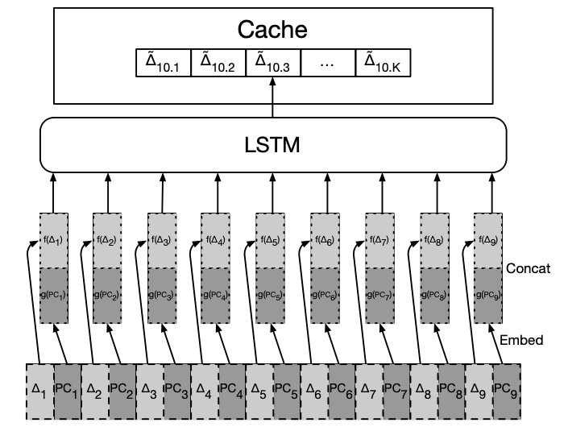

# LSTM-based Prefetcher

Embedding LSTM model is implemented in this prefetched based on the paper: [Learning Memory Access Patterns](https://arxiv.org/pdf/1803.02329.pdf)

Model Structure: 

Tested workload: 

- Dhrystone: [source code](https://www.netlib.org/benchmark/dhry-c)
  - Training Accuracy: 100%
  - Validating Accuracy: ~95%
- Canneal
  - Training Accuracy: na%
  - Validating Accuracy: na%
- Blackscholes
  - Training Accuracy: na%
  - Validating Accuracy: na%
- Ferret
  - Training Accuracy: na%
  - Validating Accuracy: na%