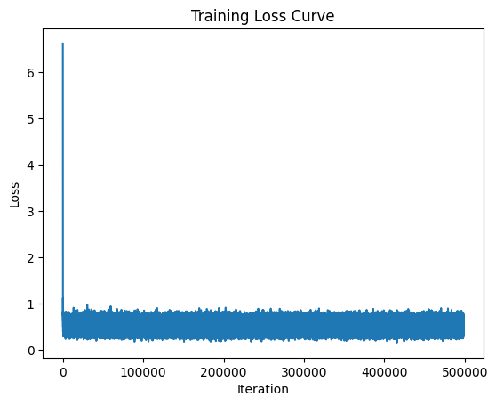

## Current settings

- Workload: Dhrystone benchmark
- Number of traces used for training and validation: **500 million**
- Epoch to run: 10
- Batch size: 256
- Average Validation Accuracy (using trained traces): 99.91%

## Output:

